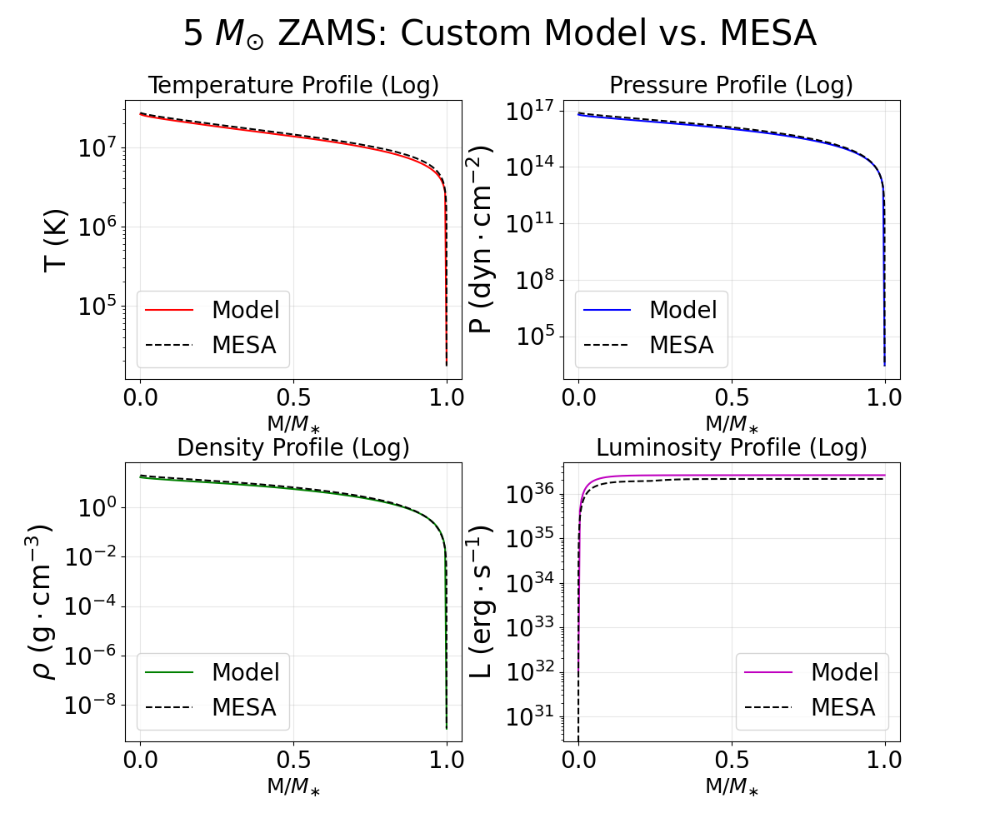
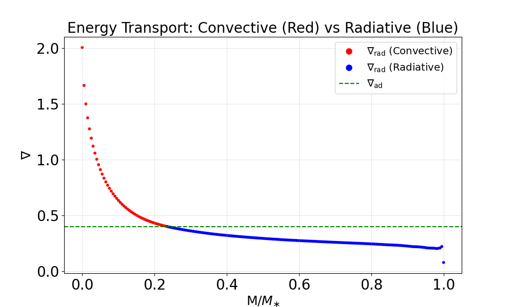

"# Stellar-Evolution-Project-JHU-2026" 
# 1D Stellar Structure Integrator (5 $M_\odot$ ZAMS)
Developed for AS.171.611: Stellar Structure and Evolution at Johns Hopkins University.

## Project Overview
This repository contains a Python-based numerical integrator for stellar structure. Using a 4th-order Runge-Kutta shooting method, the code solves the four fundamental stellar structure equations to model a 5 $M_\odot$ Zero-Age Main Sequence star.

## Physical Assumptions
We made the following assumptions:
- **Hydrostatic & Thermal Equilibrium:** The star is in a steady state.
- **Local Thermodynamic Equilibrium (LTE):** Matter and radiation are locally balanced.
- **Fully Ionized Plasma:** Mean molecular weight calculated for a fully ionized gas.
- **Chemical Homogeneity:** The mixture of Hydrogen, Helium and metals is homogeneous thrughout the star.
- **Rotation:** Effects of star's rotation are ignored.
-**Magnetic Field:** Effects of star's magnetic field are ignored.

## Results
Our model aligns closely with the MESA benchmark for mechanical variables:
- **Stellar Radius ($R_\ast$) Error:** < 5%
- **Effective Temperature ($T_{eff}$) Error:** < 8%
- **Surface Gravity ($g$) Error:** < 10%
- **Stellar Luminosity ($L_\ast$) Error:** ~21% (Attributed to CNO-cycle temperature sensitivity)



We also see that there is a convective core and a radiative envelope, as expected for a high-mass star.



## Repository Structure
- `main.py`: Main shooting-method code.
- `table.py`: Generates a table from the data from `main.py`.
- `comparison.py`: Generates the figures with the model and MESA data.
- `profile.data`: Benchmark MESA data for comparison.
- `opacity_table.txt`: Tables with different $\kappa$ values according to chemical composition.

## Usage
Ensure you have `numpy`, `matplotlib`, and `scipy` installed. Run the stellar model using:
```bash
python main.py
```

Run the following code to generate a table `stellar_structure_5Msun.csv` with the relevant stellar quantities at each differential mass element (machine-readable table):
```bash
python table.py
```

Run the following code to compare the stellar variables between MESA and the model as well as the energy transport mechanism:
```bash
python comparison.py
```

To run the code with a different stellar mass and composition, simply edit the `constants.py` file by modifying `M_target`, `X`, `Y`, `Z` and rerun the above three files.